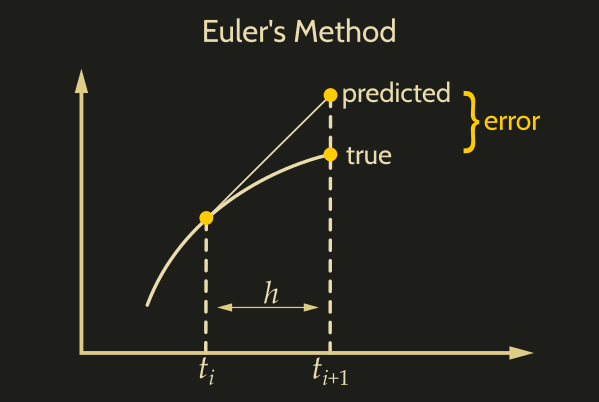
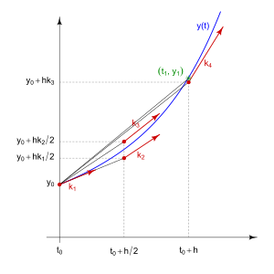

# Discretization: Numerical Integration Methods

## Introduction

Discrete-time systems are either inherently discrete (e.g. models of bank accounts, national economy growth models, population growth models, digital words) or they are obtained as a result of sampling (discretization) of continuous-time systems.

**Discretization** of linear state space models is the process of transferring continuous differential equations into discrete difference equations, suitable for numerical computting.

This process is important and is usually carried out as a first step towards making the model suitable for numerical evaluation and implementation on digital computers. 

At a high level, the process of making a continuous system discrete involves analytically taking the integral of a continous system over time or using numerical methods to estimate the integration. There are other numerical methods between Euler's first-order method and Runge-Kutta's fourth order method (and even higher order-methods) but these two methods are the most common building blocks to understand other order numerical methods.

## Objective 

In these notes we will focus on two main numerical methods for discretization, (1) Euler's method (first-order method) and (2) Runge-Kutta method(fourth-order method).

These notes will:

1. Provide a review of state space models and its notation
2. Introduce Taylor Series Expansion - a concept that is used to derive these methods
3. Define the two main numerical methods for discretization
4. Show the mathematical formulation for each of the methods
5. Provide Pros and Cons for each of the methods
6. Provide short examples for each of the methods

## Preliminaries 

### 1a. State Space Model Review and Notation

| System type                      | State-space model |
| -------------------------------- | ----------------- |
| Continous time-invariant         | $\dot{x}(t) = Ax(t) + Bu(t) \\ y(t) = Cx(t) + Du(t)$ |
| Continous time-variant           | $\dot{x}(t) = A(t)x(t) + B(t)u(t) \\ y(t) = C(t)x(t) + D(t)u(t)$ |
| Explicit discrete time-invariant | $x(k+1) = Ax(k) + Bu(k) \\ y(k) = Cx(k) + Du(k)$ |
| Explicit discrete time-variant   | $x(k+1) = A(k)x(k) + B(k)u(k) \\ y(k) = C(k)x(k) + D(k)u(k)$ |

where:

$$
\begin{aligned}
& p \text{ is the number of inputs};\\
& q \text{ is the number of outputs};\\
& n \text{ is the number of state variables};\\
& x(\cdot) \text{ is called the "state vector", } x(t) \in \mathbf{R}^n;\\
& y(\cdot) \text{ is called the "output vector", } y(t) \in \mathbf{R}^q;\\
& u(\cdot) \text{ is called the "input (or control) vector vector", } u(t) \in \mathbf{R}^p;\\
& A(\cdot) \text{ is the "state (or system) matrix", } dim[A(\cdot)] = n \times n;\\
& B(\cdot) \text{ is the "input matrix", } dim[B(\cdot)] = n \times p;\\
& C(\cdot) \text{ is the "output matrix", } dim[C(\cdot)] = q \times n;\\
& D(\cdot) \text{ is the "feedthrough (or feedforward) matrix" (in cases where the}\\ 
& \text{  system model does not have a direct feedthrough, } D(\cdot) \text{ is the zero}\\ 
& \text{  matrix), } dim[D(\cdot)] = q \times p;\\
& \dot{x}(t) := \frac{d}{dt}x(t)
\end{aligned}
$$

*Reference: https://en.wikipedia.org/wiki/State-space_representation*

### 1.b Taylor Series Expansion

Numerical integration methods like the Runge-Kutta and Euler's method can be derived through use of Taylor series expansions. This section will provide a quick review on Taylor series expansion.

A Taylor series expansion is a representation of a function as an infinite sum of terms, where each term is a polynomial evaluated at a specific point. The Taylor series expansion provides an approximation of the original function near that point.

The general form of a Taylor series expansion for a function $f(x)$ around the point $a$ is given by:

$$
f(x) = f(a) + f'(a)(x-a) + \frac{f''(a)}{2!}(x-a)^2 + \frac{f'''(a)}{3!}(x-a)^3 + \cdots 
$$

where:

- $f(a)$ is the value of the function at the point $a$,
- $f'(a)$ is the first derivative of the function evaluated at $a$,
- $f''(a)$ is the second derivative of the function evaluated at $a$,
- $f'''(a)$ is the third derivative of the function evaluated at $a$, and so on,
- $(x-a)$ represents the deviation from the point $a$,
- $n!$ denotes the factorial of $n$.

The terms beyond the linear term $f'(a)(x-a)$ involve higher-order derivatives of the function and higher powers of $(x-a)$, capturing increasingly finer details of the function's behavior near the point $a$.

By truncating the Taylor series expansion at a certain order, one can obtain a polynomial approximation of the function around the point $a$. This idea can be viewed in the Euler's method (truncating at the first-order) and Runge-Kutta method (truncating at the fourth-order). The accuracy of the approximation depends on the smoothness of the function and the distance from the point $a$.

*Reference: https://en.wikipedia.org/wiki/Taylor_series*

## Euler's Method

*image: https://m0nads.wordpress.com/tag/euler-method/*

The Euler method is a first-order method for solving ODEs with a given value. It is the most basic explicit method for numerical intergration of ODEs and is simplest Runge-Kutta method

**Mathematical Formulation:**

$$x_{k+1} = x_{k} + \dot{x}(t(k))\Delta t$$

where,

$$\Delta t \text{ (or } h \text{) is a constant step size}$$

### Advantages and Limitations:

- **Advantages**
    - Simple and easy to implement
    - Requires only basic mathematical operations
    suiteable for problems where analytical solutions are unavasilable or impractical.

- **Disadvantages**
    - May not provide accurate results for highly nonlinear or stiff ODEs.
    - Approximation error is proportional to the step size, $\Delta t$, chosen. Good approximation is obtained with very small $\Delta t$ but would require a large number of time discretixations leading to a large computation time.

### When is it used?:

Euler's method can be used when the system does not grow too quickly.

Euler's method is rarely used in real-world applications as the algorithm tends to have low accuracy and requires vast computation time.

### Great Reference to Learn More

- https://courses.lumenlearning.com/calculus2/chapter/eulers-method/

## Runge-Kutta

*image: https://en.wikipedia.org/wiki/Runge%E2%80%93Kutta_methods*

The Runge-Kutta method is a family of implicit and explicit iterative methods which include the Euler's method, which is looked at already.

**Mathematical Formulation:**

$$x_{k+1} = x_{k} + \left(\frac{m_1 + 2m_2 + 2m_3 + m_4}{6}\right)\Delta t$$

where,

$$
\begin{aligned}
&\Delta t \text{ (or } h \text{) is a constant step size};\\
&\dot{x} = f(x,u,t(k))\\
&m_1 = f(x_k,u_k,t(k))\\
&m_2 = f\left(x + \Delta t\frac{m_1}{2},u_k,t(k) + \frac{\Delta t}{2}\right)\\
&m_3 = f\left(x + \Delta t\frac{m_2}{2},u_k,t(k) + \frac{\Delta t}{2}\right)\\
&m_4 = f\left(x + m_3\Delta t,u_k,t(k) + \Delta t\right)
\end{aligned}
$$

### Advantages and Limitations:

- **Advantages**
    - Generally more accurate than simpler methods like Euler's method. They achieve this by using high-order Taylor series expansions to approximate the solution.
    - Easy to implement
    - Stable for a wide range of problems, including stiff systems. This stability ensures that the numerical solution remains bounded and does not grow uncontrollably even for challenging ODEs.
- **Disadvantages**
    - Can be computationally expensive compared to lower-order methods. This is because they require more function evaluations per step, leading to longer computation times, especially for systems with many equations or stiff systems.
    - Can suffer from error propagation, where errors accumulate over time and lead to inaccuracies in the solution. While higher-order methods reduce this effect, it still remains a concern, expecially for long integration intervals or highly sensitive systems.
    - Selecting a step size that balances accuracy and computational cost requires careful consideration and can be challanging.

### When is it used?:

The Runge-Kutta method is best applied to systems that need medium to high accuracy requirements, smooth and non-stiff systems, and systems with continuous inputs.

### Great Reference to Learn More

- https://math.okstate.edu/people/yqwang/teaching/math4513_fall11/Notes/rungekutta.pdf
